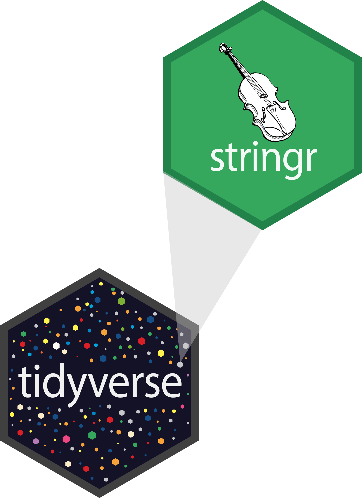

# Data types {background-gradient="linear-gradient(to bottom right, #FFFFFF, #7CDCFF, #7CDCFF, #7CDCFF)"}
```{r}
#| label: packages
#| echo: FALSE
#| message: FALSE
#| warning: FALSE
library(tidyverse)
library(readxl)
library(haven)
library(glue)
library(emojifont)
options(width=69)
```

```{r}
#| label: load-data
#| echo: false
spss_ex<-read_sav("../data/import/svy_spss.sav")
penguins<-tibble(penguins)
```

## Data types in R

- **logical**
- **character**
- **double**
- **integer**

## Logical & character

::: {.column}
**logical** - boolean values `TRUE` and `FALSE`

```{r}
#| label: logical
typeof(TRUE)
```
:::
::: {.column}
**character** - character strings

```{r}
#| label: character
typeof("hello")
```
:::

## Double & integer

::: {.column}
**double** - floating point numerical values (default numerical type)

```{r}
#| label: double
typeof(1.335)
typeof(7)
```
:::
::: {.column}
**integer** - integer numerical values (indicated with an `L`)

```{r}
#| label: integer
typeof(7L)
typeof(1:3)
```
:::

## Vectors

Vectors can be constructed using the `c()` function.

```{r}
#| label: vectors
c(1, 2, 3)
c("Hello", "World!")
c(c("hi", "hello"), c("bye", "jello"))
```

## Converting between types

::: {.column}
```{r}
#| label: conversion-1
x <- 1:3
x
typeof(x)
```
:::

:::: {.column}
::: {.fragment}
```{r}
#| label: conversion-2
y <- as.character(x)
y
typeof(y)
```
:::
::::

## Converting between types

::: {.column}
```{r}
#| label: conversion-3
x <- c(TRUE, FALSE)
x
typeof(x)
```
:::

:::: {.column}
::: {.fragment}
```{r}
#| label: conversion-4
y <- as.numeric(x)
y
typeof(y)
```
:::
::::

## Converting between types

R will happily convert between various types without complaint when different types of data are concatenated in a vector, and that's not always a great thing!

::: {.column}
```{r}
#| label: conversion-5
c(1, "Hello")
c(FALSE, 3L)
```
:::

::: {.column}
```{r}
#| label: conversion-6
c(1.2, 3L)
c(2L, "two")
```
:::

## Explicit vs. implicit coercion

Let's give formal names to what we've seen so far:

. . .

- **Explicit coercion** is when you call a function like `as.logical()`, `as.numeric()`, `as.integer()`, `as.double()`, or `as.character()`

. . .

- **Implicit coercion** happens when you use a vector in a specific context that expects a certain type of vector


## Special values

- `NA`: Not available
- `NaN`: Not a number
- `Inf`: Positive infinity
- `-Inf`: Negative infinity

. . .

::: {.column}
```{r}
#| label: special-1
pi / 0
0 / 0
```
:::
::: {.column}
```{r}
#| label: special-2
1/0 - 1/0
1/0 + 1/0
```
:::

## Missing data

- `is.na()` function allows us to determine if a value is missing

. . .

- Can be very helpful when working with `case_when()` or `if_else()` statements

. . .

- requires data to have explicit missing, so must be careful when working with strings

:::: column
::: fragment
```{r}
#| label: missing-1
miss_array<-c(NA, 5, "", "Text")

typeof(miss_array)

miss_array
```
:::
::: fragment
```{r}
#| label: missing-2
is.na(miss_array)
```
:::
::::

:::: column
::: fragment
```{r}
#| label: missing-3
case_when(is.na(miss_array) == "" ~ 1,
          TRUE ~ 0)
```
:::
::: fragment
```{r}
#| label: missing-4
case_when(miss_array == "" ~ 1,
          TRUE ~ 0)
```
:::
::: fragment
```{r}
#| label: missing-5
case_when(is.na(miss_array) | miss_array == "" ~ 1,
          TRUE ~ 0)
```
:::
::::

# Data classes {background-gradient="linear-gradient(to bottom right, #FFFFFF, #FECCDD, #FECCDD, #FECCDD)"}

## Data classes in R

- **factor**
- **datetime**
- **data frame**
- **list**

# Factors {background-gradient="linear-gradient(to bottom right, #FFFFFF, #7CDCFF, #7CDCFF, #7CDCFF)"}

## Factors

R uses factors to handle categorical variables, variables that have a fixed and known set of possible values

```{r}
#| label: factor-setup
x <- factor(c("BS", "MS", "PhD", "MS"))
x
```

. . .

::: {.column}
```{r}
#| label: factor-type
typeof(x)
```
:::

::: {.column}
```{r}
#| label: factor-class
class(x)
```
::: 

. . .

We can think of factors like character (level labels) and an integer (level numbers) glued together

```{r}
#| label: factor-glimpse
glimpse(x)
as.integer(x)
```

## Working with factors

`handedness` variable in the cat lovers data shows everything imported as categorical

```{r}
#| label: cat-lovers
cat_lovers <- read_csv("../data/cat-lovers.csv")
glimpse(cat_lovers)
```

## Working with factors - plotting

Keeping `handedness` as a character outputs in *alphabetical* order

```{r}
#| label: plot-cat
#| fig-align: center
ggplot(cat_lovers, mapping = aes(x = handedness)) +
  geom_bar()
```

## Use forcats to manipulate factors

Changing `handedness` to a factor, outputs in *level* order

```{r}
#| label: plot-cat2
#| fig-align: center
#| code-line-numbers: "2-4"
cat_lovers %>%
  mutate(handedness = 
           factor(handedness, 
                  level = c("left", "right", "ambidextrous"))) %>%
  ggplot(mapping = aes(x = handedness)) +
  geom_bar()
```

## Come for the functionality ...

<br>
stay for the logo

```{r}
#| label: image-forcats
#| echo: FALSE
knitr::include_graphics("images/forcats-part-of-tidyverse.png")
```

. . .

- Factors are useful when you have true categorical data and you want to override the ordering of character vectors to improve display 

. . .

- They are also useful in modeling scenarios 

. . .

- The **forcats** package provides a suite of useful tools that solve common problems with factors


## forcats functions

:::: {.column}
::: {.incremental}
- `factor(x)` turns a vector into a factor vector
    - default levels are alphabetical
    - can set level order using `levels = ` argument
- `levels(f)` returns the levels for a factor
- `fct_count(f)` provides a count of the number of cases in each level
- `fct_unify()` standardizes levels across a list of factors

:::
::::

:::: {.column}
::: {.incremental}
- reorder factor levels:
    - `fct_rev(f)` reverses the order of the levels
    - `fct_infreq(f)` changes the level order based on frequency
    - and many more
- change factor levels:
    - `fct_recode(f, d = "a", e = "b")` changes the levels manually
    - `fct_collapse(f, d = c("a", "b"))` collapses two or more levels into one
    - and many more
    
:::
::::

::: {.footnote}
See [https://forcats.tidyverse.org/](https://forcats.tidyverse.org/) for more details
:::

# {background-gradient="radial-gradient(#FFA219, #FFFFFF, #FFFFFF)"}

::: {.tip}
`r emoji('bulb')`<b>Tip!</b> <br><br> 
Factor functions should be called in `mutate()` as you are mutating the variable
:::

## Factor example - penguins

```{r}
#| label: factor-ex-1
glimpse(penguins)
```

## Factor example - penguins (cont.)

```{r}
#| label: factor-ex-2
#| error: true
penguins %>% 
  fct_collapse(NewIsland = c("Dream", "Torgersen"))
```

. . .

```{r}
#| label: factor-ex-3
penguins %>% 
  mutate(island2 = fct_collapse(island, NewIsland = c("Dream", "Torgersen"))) %>% 
  count(island, island2)
```


# Your turn: <br>Factor variables {background-gradient="linear-gradient(to bottom, #FFFFFF, #FFFFFF, #6BE1CA)"}

`r emojifont::emoji("raised_hand")` if you have questions or need help

`r fontawesome::fa("comment")` when you are finished

```{r}
#| echo: false
countdown::countdown(minutes = 15, seconds = 0, play_sound = TRUE)
```


# Dates {background-gradient="linear-gradient(to bottom right, #FFFFFF, #FECCDD, #FECCDD, #FECCDD)"}

## Dates

Two ways to handle dates

::: column
`as.Date()` from base R
```{r}
#| label: dates-base
y1 <- as.Date("2020-01-01")
y1
typeof(y1)
class(y1)
```
:::

:::: column
::: fragment
**lubridate** from the tidyverse
```{r}
#| label: dates-ymd
y2 <- ymd("2020-01-01")
y2
typeof(y2)
class(y2)
```
:::
::::

## lubridate

::: {.column width=35%}
```{r}
#| label: images-lubridate
#| echo: FALSE
#| out.width: "80%"
#| fig-align: center

```
::: 
:::: {.column width=65%}
::: {.incremental}
- Create date/time variables from strings or numbers
    - function name based on the order of the elements in the raw data
    - `ymd()` looks for a date in year, month, day format
    - `mdy()` looks for a date in month, day, year format
    - `ymd_hms()` looks for a datetime in year, month, day, hour, minute, second format
    - `make_datetime()` has arguments for each component of a datetime variable
- Parse datetime components from a date/time variable
    - `date()` will parse just the date component of a datetime variable
    - `year()` and `hour()` will parse just the year and hour components

:::
::::

::: {.notes}
- delimiters are ingored when creating the variables: "2025/07/10" and "20250710" will both create a date variable without having to specify the delimiter
:::

## lubridate examples {.smaller}

::: column
```{r}
#| label: lubridate-ex-1
#| code-line-numbers: "3,4"
spss_ex %>% 
  filter(LastConnectionDate != "") %>% 
  mutate(LastDate_Formatted = 
           ymd(LastConnectionDate)) %>% 
  select(LastConnectionDate, LastDate_Formatted)
```
:::

:::: column
::: fragment
```{r}
#| label: lubridate-ex-2
#| code-line-numbers: "3,4"
spss_ex %>% 
  filter(LastConnectionStartTime != "") %>% 
  mutate(LastStartTime_Formatted =
           parse_date_time(LastConnectionStartTime, "HMS")) %>% 
  select(LastConnectionStartTime, LastStartTime_Formatted)
```
:::

::: fragment
Note that the ymd and other functions, expect a character value
Note that the output here shows a "phantom" date when only a time is provided
:::
::::

## lubridate examples (cont.) {.smaller}

```{r}
#| label: lubridate-ex-3
#| warning: false
#| code-line-numbers: "|2|3"
spss_ex %>% 
  mutate(DateTime_Char = glue("{LastConnectionDate} {LastConnectionStartTime}"),
         LastDateTime_Formatted = ymd_hms(DateTime_Char)) %>% 
  filter(LastConnectionStartTime != "") %>% 
  select(LastConnectionDate, LastConnectionStartTime, 
         DateTime_Char, LastDateTime_Formatted)
```

## Calculating time differences {.smaller}

How may days since the start of data collection did a person respond?

```{r}
#| label: lubridate-diffs
#| code-line-numbers: "|2|3|4" 
spss_ex %>% 
  mutate(days_to_complete = 
           time_length(ymd(LastConnectionDate) - ymd("20250315"), 
                       unit = "days")) %>% 
  select(LastConnectionDate,days_to_complete) %>% 
  filter(LastConnectionDate != "")

```


# Your turn: <br>Date variables {background-gradient="linear-gradient(to bottom, #FFFFFF, #FFFFFF, #6BE1CA)"}

`r emojifont::emoji("raised_hand")` if you have questions or need help

`r fontawesome::fa("comment")` when you are finished

```{r}
#| echo: false
countdown::countdown(minutes = 15, seconds = 0, play_sound = TRUE)
```

# Working with strings {background-gradient="linear-gradient(to bottom right, #FFFFFF, #7CDCFF, #7CDCFF, #7CDCFF)"}

## stringr

::: {.column}
```{r}
#| label: images-stringr
#| echo: FALSE
#| out.width: "80%"
#| fig-align: center

```
::: 
:::: {.column}
::: {.incremental}
Functions to work with strings

    - detect matches
    - subset strings
    - manage lengths
    - mutate strings
    - join and split strings

:::
::::

## Typical stringr function format

Most string functions are in the format:
```{r}
#| label: stringr-format
#| eval: false
#| code-line-numbers: "|1|2|3|"
func_name(
  string,
  pattern,
  ...
)
```

## Detect matches {.smaller}

`string_detect(string, pattern)`: Detects the presence of a pattern match in a string

::: column
```{r}
#| label: stringr-detect
starwars %>% 
  select(name, hair_color) %>% 
  filter(hair_color == "brown")
```
:::

:::: column
::: fragment
```{r}
#| label: stringr-detect-2
starwars %>% 
  select(name, hair_color) %>% 
  filter(str_detect(hair_color,"brown"))
```
:::
::::

## Subset strings {.smaller}

`str_sub(string, start, end)`: Subset strings based on a known location
`str_extract(string, pattern)`: Return the first pattern match found

::: column
```{r}
#| label: stringr-sub-1
starwars %>% 
  select(name, hair_color) %>% 
  mutate(primary_hair = str_sub(hair_color, 1, 5))
```
:::

:::: column
::: fragment
```{r}
#| label: stringr-sub-2
starwars %>% 
  select(name, hair_color) %>% 
  mutate(primary_hair = str_extract(hair_color, "^.*,"))
```
:::
::::

## Regular expressions

Powerful...yet annoying

. . .

A few common ones you will likely use:

| operator | definition |   | operator | definition |
|----------|------------------------|----|------------|------------------------|
| `^` | start of a string |  | `[:alpha:]` | all upper and lower case alpha characters |
| `$` | end of a string |  |  `[:digit:]` | all numeric digits |
| `.` | any character |  | `[:alnum:]` | all `[:alpha:]` + all `[:digit:]` |
| `a*` | zero or more "a" in a row |  | `[abe]` | one of the letters in brackets |
| `a{n}` | exactly n "a" characters in a row |  | `[^abe]` | anything but the letters in brackets |

. . .

When I work with strings, the [stringr cheatsheet](https://rstudio.github.io/cheatsheets/strings.pdf) is always open in a browser (or on my desk)!

## Subset strings {.smaller}

`str_extract(string, pattern)`: Return the first pattern match found

::: column
```{r}
#| label: stringr-sub-3
starwars %>% 
  select(name, hair_color) %>% 
  mutate(primary_hair = str_extract(hair_color, "^.*,"))
```
:::

:::: column
::: fragment
```{r}
#| label: stringr-sub-4
starwars %>% 
  select(name, hair_color) %>% 
  mutate(primary_hair = str_extract(hair_color, "^.*(?=,)"))
```
:::
::::

## Mutate strings

`str_replace(string, pattern, replacement)`: Replace the first matched patttern

```{r}
#| label: stringr-replace-1
starwars %>% 
  select(name, hair_color) %>% 
  mutate(new_hair = str_replace(hair_color, "blond", "rainbow")) %>% 
  filter(str_detect(hair_color,"blond"))
```

## Mutate strings (cont.)

`str_replace(string, pattern, replacement)`: Replace the first matched patttern

```{r}
#| label: stringr-replace-2
starwars %>% 
  select(name, hair_color) %>% 
  mutate(additional_colors = str_replace(hair_color, "^.*, ", "")) %>% 
  filter(str_detect(hair_color,","))
```


## Split strings

`str_split_i(string, pattern, n)`: Split at the pattern, and return the nth substring


```{r}
#| label: stringr-replace-3
starwars %>% 
  select(name, hair_color) %>% 
  mutate(additional_colors = str_split_i(hair_color, ", ", 2)) %>% 
  filter(str_detect(hair_color,","))
```


## Other helpful string functions

::: {.incremental}
- `str_length(string)`: number of characters (also `nchar(string)`)
- `str_pad(string, width, side, pad = " ")`: pad the string with additional characters (default is to pad with a space, but can also use this to pad leading 0s)
- `str_trim(string, side)`: trim whitespace from the start and/or end of a string
- `str_squish(string)`: trim whitespace from both ends and collapse multiple spaces in the middle into a single space
- `toupper(string)`: converts the entire string to uppercase
- `tolower(string)`: converts the entire string to lowercase
:::

# Your turn: <br>String variables {background-gradient="linear-gradient(to bottom, #FFFFFF, #FFFFFF, #6BE1CA)"}

`r emojifont::emoji("raised_hand")` if you have questions or need help

`r fontawesome::fa("comment")` when you are finished

```{r}
#| echo: false
countdown::countdown(minutes = 15, seconds = 0, play_sound = TRUE)
```